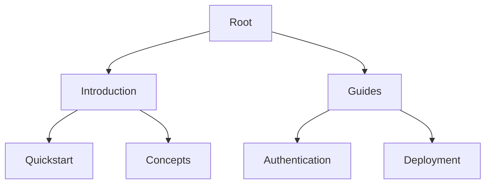

## Overview

Rahul Sharma's documentation platform provides a structured space to organize project knowledge. You create, manage, and share docs efficiently using a hierarchical system, version control, collaboration tools, and integrations.

This page covers the four core concepts: document hierarchy, version control basics, collaboration workflows, and external tool integrations. Master these to build scalable documentation.

<Callout kind="info">
These concepts form the foundation. Customize them to fit your project's needs.
</Callout>

## Key Concepts

Visualize the main pillars using these feature cards:

<Columns cols={2}>
  <Card title="Hierarchy" icon="layers" href="#document-hierarchy">
    Organize docs in nested folders and pages for intuitive navigation.
  </Card>
  <Card title="Version Control" icon="git-branch" href="#version-control">
    Track changes with Git integration for reliable history.
  </Card>
  <Card title="Collaboration" icon="users" href="#collaboration">
    Review, comment, and merge contributions seamlessly.
  </Card>
  <Card title="Integrations" icon="plug" href="#integrations">
    Connect with tools like GitHub, Slack, and CI/CD pipelines.
  </Card>
</Columns>

## Document Hierarchy and Structure

<IDocument-hierarchy />

Structure your docs like a tree. Top-level pages (e.g., `/introduction`) contain sub-pages (e.g., `/quickstart`). Use YAML frontmatter for metadata.



This setup ensures logical navigation. Define hierarchy in a `nav.yaml` file:

````yaml
nav:
  - title: Introduction
    href: /introduction
  - title: Concepts
    children:
      - title: Hierarchy
        href: /concepts#hierarchy
````

## Version Control Basics

Integrate Git for change tracking. You commit docs as Markdown/MDX files.

<CodeGroup tabs="Bash,PowerShell">
````bash
git init
git add docs/
git commit -m "Initial docs"
git push origin main
````

````powershell
git init
git add docs/
git commit -m "Initial docs"
git push origin main
````
</CodeGroup>

Branch for features: `git checkout -b feature/new-guide`. Merge via pull requests.

<Callout kind="tip">
Use semantic commit messages: `feat: add concepts page`, `fix: typo in overview`.
</Callout>

## Collaboration Workflows

Follow these steps for team contributions:

<Steps>
  <Step title="Fork or Branch" icon="git-branch">
    Create a branch: `git checkout -b rahul/new-feature`.
  </Step>
  <Step title="Edit Docs" icon="edit-3">
    Update MDX files locally.
  </Step>
  <Step title="Review Changes" icon="eye">
    Push and open a pull request. Add reviewers.
  </Step>
  <Step title="Merge and Deploy" icon="git-merge">
    Approve, merge, and trigger preview builds.
  </Step>
</Steps>

## Integration with External Tools

Connect your docs to ecosystems using these methods:

<Tabs>
  <Tab title="GitHub" icon="github">
    Sync repos automatically. Webhooks notify on pushes.
    
    ```yaml
    webhook:
      url: https://docs.example.com/webhook/github
      events: [push, pull_request]
    ```
  </Tab>
  <Tab title="Slack" icon="message-circle">
    Post updates to channels.
    
    ```javascript
    fetch('https://hooks.slack.com/services/YOUR_WEBHOOK', {
      method: 'POST',
      body: JSON.stringify({ text: 'Docs updated!' })
    });
    ```
  </Tab>
  <Tab title="CI/CD" icon="play">
    Build previews on Netlify/Vercel.
    
    <Expandable title="Advanced Config">
      Set `DOCS_PREVIEW=true` in environment variables.
    </Expandable>
  </Tab>
</Tabs>

<Callout kind="success">
Integrate early to automate workflows and reduce manual effort.
</Callout>

## Best Practices

- Maintain flat hierarchies: Limit nesting to 3 levels.
- Use consistent naming: Kebab-case for files (`core-concepts.mdx`).
- Automate deployments with GitHub Actions.

<Expandable title="Advanced: Custom Plugins" default-open="false">
Develop MDX plugins for custom components.
</Expandable>

These concepts empower you to scale documentation as projects grow.